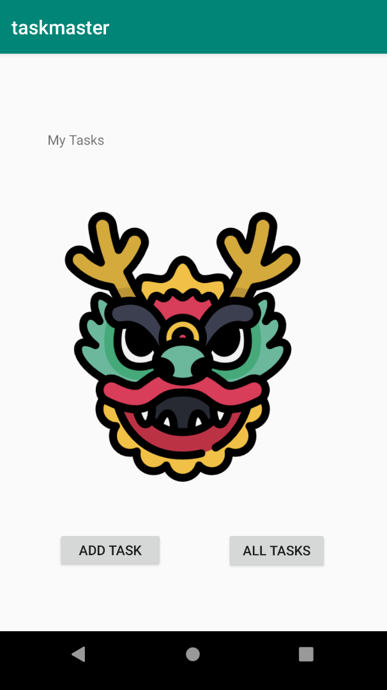
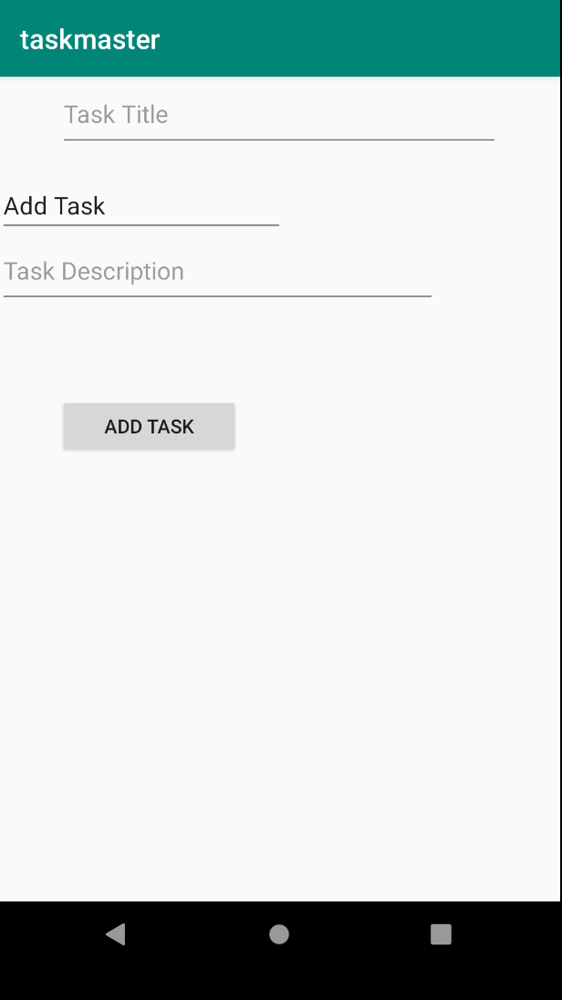
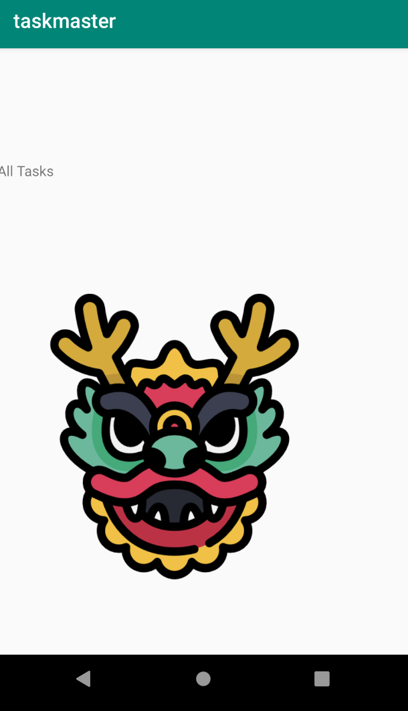
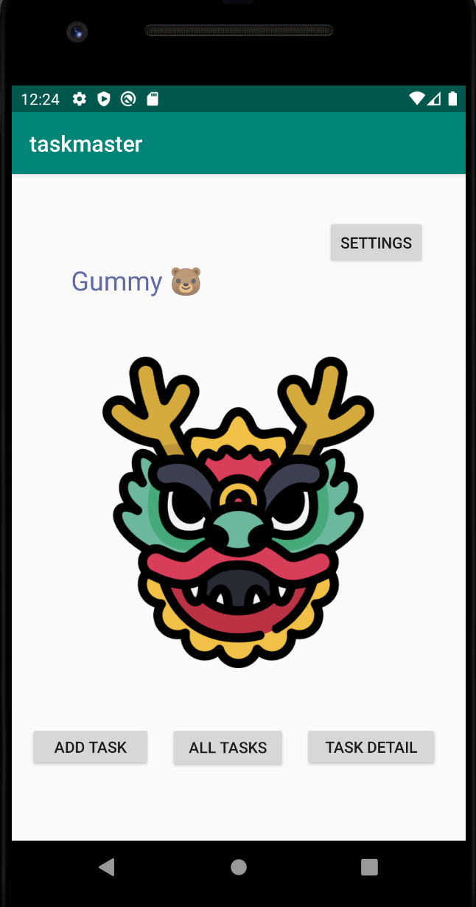
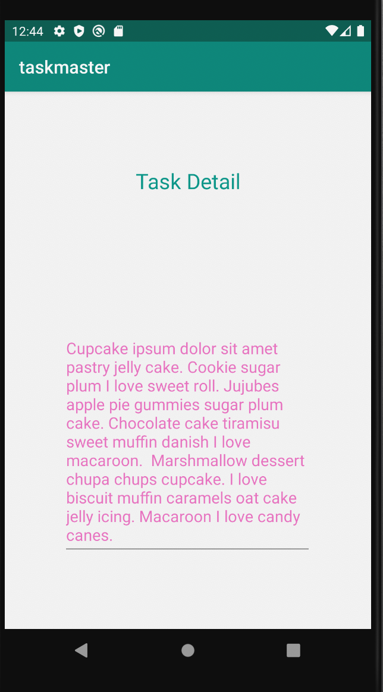
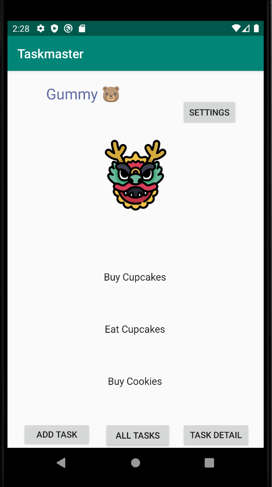
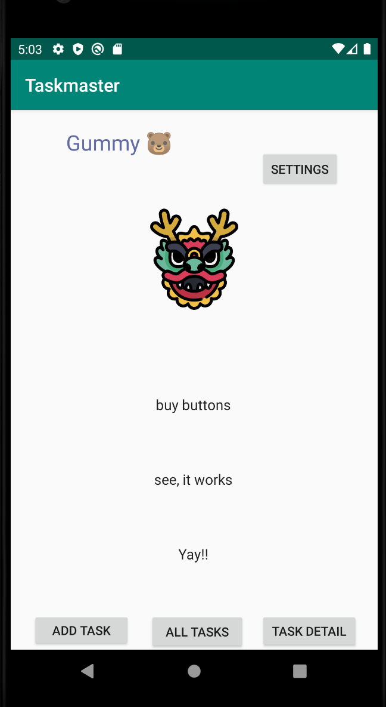
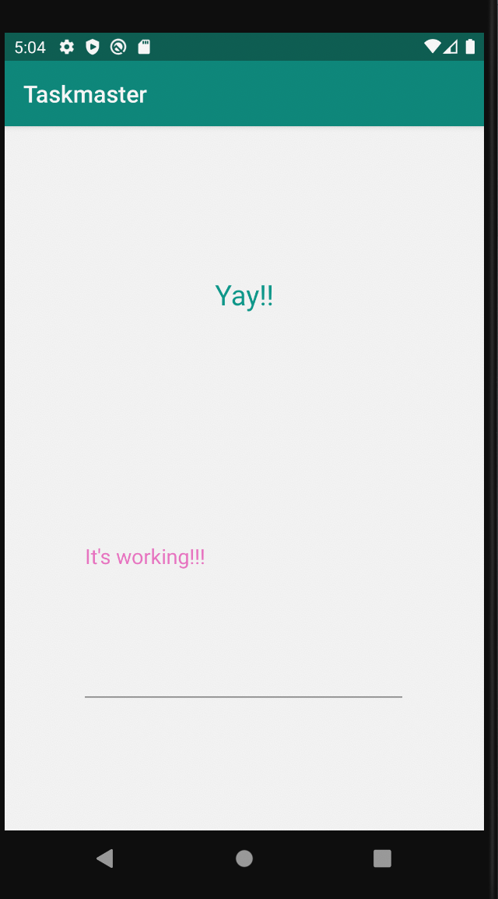

# TaskMaster

### Setup
To start, create a new directory and repo to hold this app. Name it taskmaster.
Within that directory, use Android Studio to set up a new app.

### Feature Tasks
Homepage
The main page should be built out to match the wireframe. In particular, it should have a heading
at the top of the page, an image to mock the “my tasks” view, and buttons at the bottom of the page
to allow going to the “add tasks” and “all tasks” page.

### Add a Task
On the “Add a Task” page, allow users to type in details about a new task, specifically a title and
a body. When users click the “submit” button, show a “submitted!” label on the page.

### All Tasks
The all tasks page should just be an image with a back button; it needs no functionality.

## Adding Data to TaskMaster

### Task Detail Page
Create a Task Detail page. It should have a title at the top of the page, and a Lorem Ipsum
description.

### Settings Page
Create a Settings page. It should allow users to enter their username and hit save.

### Homepage
The main page should be modified to contain three different buttons with hardcoded task titles.
When a user taps one of the titles, it should go to the Task Detail page, and the title at the
top of the page should match the task title that was tapped on the previous page.

The homepage should also contain a button to visit the Settings page, and once the user has entered
their username, it should display “{username}’s tasks” above the three task buttons.

## Feature Tasks (lab 28)

### Task Model
Task class. Task has a title, a body, and a state. The state is one of “new”, “assigned”,
“in progress”, or “complete”.

Homepage
Homepage is refactored to use RecyclerView for displaying Task data. This has hardcoded
Task data for now.

A ViewAdapter class displays data from a list of Tasks.
In your MainActivity, create at least three hardcoded Task instances and use those to populate
your RecyclerView/ViewAdapter.

When you tap on any one of the Tasks in the RecyclerView, it will appropriately
launch the detail page with the correct Task title displayed.

## Feature Task (lab 32)

### Task Model
Task Model and Room
Following the directions provided in the Android documentation, set up Room in your application,
and modify your Task class to be an Entity.

Add Task Form
Modify your Add Task form to save the data entered in as a Task in your local database.

Homepage
Refactor your homepage’s RecyclerView to display all Task entities in your database.

Detail Page
Ensure that the description and status of a tapped task are also displayed on the detail page, in
addition to the title. (Note that you can accomplish this by passing along the entire Task entity,
or by passing along only its ID in the intent.)

## Feature Task (lab 33)

### Task Model
Polish and add All Tasks Page
Today, your app will add a new activity for all tasks with a Recycler View showing all tasks.
These tasks must be clickable. When clicked on, trigger a Toast that displays details about the task.

## Feature Task (lab 37)

### Task Model
Uploads
On the “Add a Task” activity, allow users to optionally select a file to attach to that task. If a
user attaches a file to a task, that file should be uploaded to S3, and associated with that task.

Displaying Files
On the Task detail activity, if there is a file that is an image associated with a particular Task,
that image should be displayed within that activity. (If the file is any other type, you should
display a link to it.)

## Feature Task (lab 40)

### Task Model
Feature Tasks
Notifications on Task Creation
When a new task is created within a team, alert all users who are a part of that team about that new task.

There are several steps involved in allowing this to work:

Store which team a user is part of in the cloud
Add a Lambda trigger on task creation
Use SNS to send a notification as part of that Lambda

## Feature Task (lab 41)

### Overview
    Today, your app will allow users to “share” a photo from another app and open TaskMaster,
    ready to upload that image as part of a new task.

    Setup
    Continue working in your taskmaster repository.

    Feature Tasks
    Adding a Task from Another Application
    Add an intent filter to your application such that a user can hit the “share” button on an
    image in another application, choose TaskMaster as the app to share that image with, and be
    taken directly to the Add a Task activity with that image pre-selected.